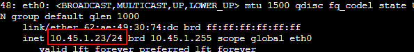
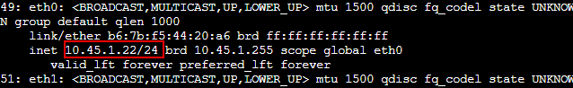
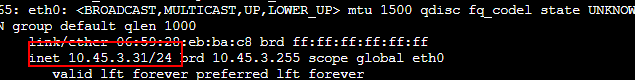
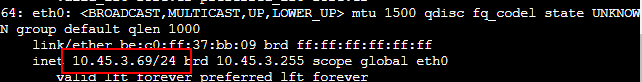
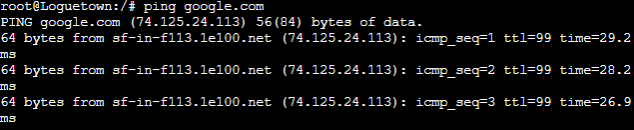
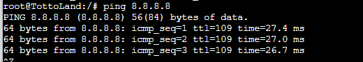
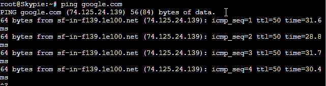

# Jarkom-Modul-3-T7-2021
### SOAL 1 dan 2

#### JAWABAN

### SOAL 3

#### JAWABAN

### SOAL 4
Client yang melalui Switch3 mendapatkan range IP dari [prefix IP].3.30 - [prefix IP].3.50 (4)
#### JAWABAN
Lakukan konfigurasi untuk rentang IP yang akan diberikan pada file  /etc/dhcp/dhcpd.conf dengan cara menambahkan konfigurasi berikut ini 
```
subnet 10.45.3.0 netmask 255.255.255.0 {
    range  10.45.3.30 10.45.3.50;
    option routers 10.45.3.1;
    option broadcast-address 10.45.3.255;
    option domain-name-servers 10.45.2.2;
    default-lease-time 720;
    max-lease-time 7200;
}
```

Dengan begitu kita telah menentukan ip range  dengan menambahkan ```range  10.45.3.30 10.45.3.50;```pada subnet interface switch 3 yang terhubung ke fosha pada eth3

### SOAL 5
Client mendapatkan DNS dari EniesLobby dan client dapat terhubung dengan internet melalui DNS tersebut. (5)
#### JAWABAN
Untuk client mendapatkan DNS dari EniesLobby diperlukan konfigurasi pada file /etc/dhcp/dhcpd.conf dengan ```option domain-name-servers 10.45.2.2;```

Supaya semua client dapat terhubung internet pada EniesLobby diberikan konfigurasi pada file /etc/bind/named.conf.options dengan
```
options {
        directory \"/var/cache/bind\";

        forwarders {
                8.8.8.8;
                8.8.8.4;
        };

        // dnssec-validation auto;
        allow-query { any; };
        auth-nxdomain no;    # conform to RFC1035
        listen-on-v6 { any; };
};
```
Dengan mengkonfigurasi DHCP server dan DHCP Relay seleuruh Client yang berada pada subnet interface switch 1 dan switch 3 akan otomatis mendapatkan IP pada rentang yang telah dikonfigurasi. Untuk contohnya adalah sebagai berikut:
[ Loguetown ]

[ Alabasta ]

[ TottoLand ]

[ Skypie ]


Semua Client juga akan bisa konek ke internet
[ Loguetown ]

[ Alabasta ]

[ TottoLand ]

[ Skypie ]


### SOAL 6
Lama waktu DHCP server meminjamkan alamat IP kepada Client yang melalui Switch1 selama 6 menit sedangkan pada client yang melalui Switch3 selama 12 menit. Dengan waktu maksimal yang dialokasikan untuk peminjaman alamat IP selama 120 menit. (6)
#### JAWABAN
Pada subnet interface switch 1 dan 3 ditambahkan konfigurasi berikut pada file /etc/dhcp/dhcpd.conf
```
subnet 10.45.1.0 netmask 255.255.255.0 {
    ...
    default-lease-time 360; 
    max-lease-time 7200;
    ...
}
subnet 10.45.3.0 netmask 255.255.255.0 {
    ...
    default-lease-time 720;
    max-lease-time 7200;
    ...
}
```