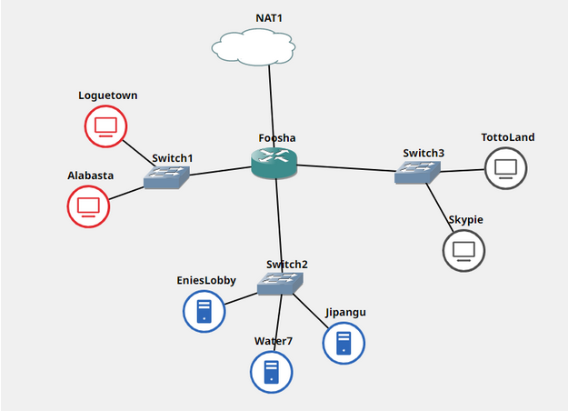
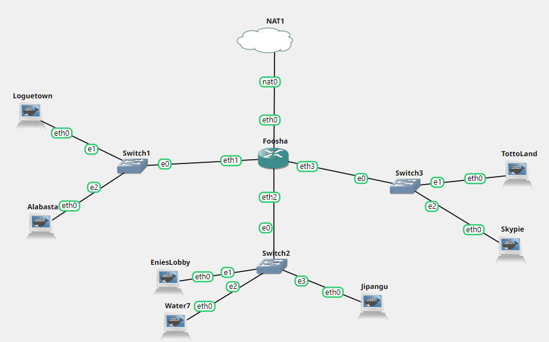
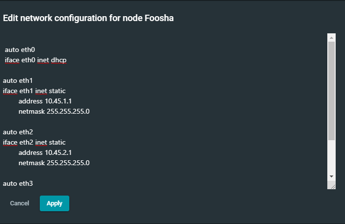
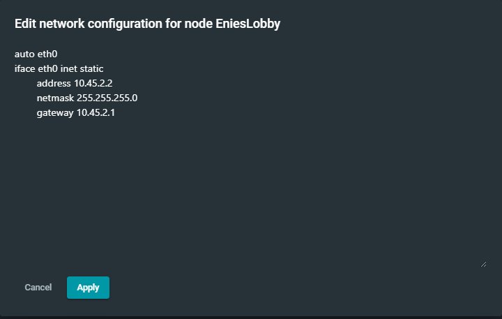
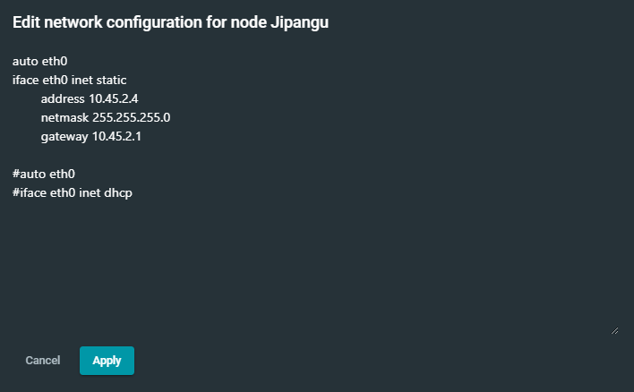
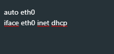
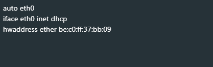

# Jarkom-Modul-3-T7-2021      
### Laporan Resmi Pengerjaan Sesi Lab Jaringan Komputer     
        
#### Nama Anggota Kelompok :      
1. Naufal Aprilian (05311940000007)     
2. Bryan Yehuda Mannuel (05311940000021)      
3. Mulki Kusumah    

## Jawaban Modul 

### SOAL 1 dan 2
Luffy yang sudah menjadi Raja Bajak Laut ingin mengembangkan daerah kekuasaannya dengan membuat peta seperti berikut:



Luffy bersama Zoro berencana membuat peta tersebut dengan kriteria EniesLobby sebagai DNS Server, Jipangu sebagai DHCP Server, Water7 sebagai Proxy Server (1) dan Foosha sebagai DHCP Relay (2). Luffy dan Zoro menyusun peta tersebut dengan hati-hati dan teliti.
#### JAWABAN
[ EniesLobby ] -> DNS server

EniesLobby sebagai DNS Server sehingga perlu melakukan install bind9
```
echo "nameserver 192.168.122.1" > /etc/resolv.conf
apt-get update
apt-get install bind9 -y
```

[ Skypea ] -> web server

Skypea sebagai Web server sehingga perlu melakukan download apache
```
apt-get install apache2 -y
service apache2 start
apt-get install php -y
apt-get install libapache2-mod-php7.0 -y
apt-get install ca-certificates openssl -y
```

[ Water7 ] -> Proxy server

Water7 Sebagai Proxy server sehingga perlu melakukan install squid
```
echo "nameserver 192.168.122.1" > /etc/resolv.conf
apt-get update
apt-get install libapache2-mod-php7.0 -y
apt-get install squid -y
```
[ Fosha ] -> DHCP Relay

Fosha sebagai DHCP Relay sehingga perlu melakukan install isc-dhcp-relay
```
apt-get update
apt-get install isc-dhcp-relay -y
```
[ Jipangu ] -> DHCP Server

```
echo "nameserver 192.168.122.1" > /etc/resolv.conf
apt-get update
apt-get install isc-dhcp-server -y
```
Kami juga sudah membuat topologi



Untuk konfigurasi setiap nodenya adalah sebagai berikut

[ Foosha ]



untuk lebih lengkapnya adalah sebagai berikut:
```
 auto eth0
 iface eth0 inet dhcp

auto eth1
iface eth1 inet static
	address 10.45.1.1
	netmask 255.255.255.0

auto eth2
iface eth2 inet static
	address 10.45.2.1
	netmask 255.255.255.0

auto eth3
iface eth3 inet static
	address 10.45.3.1
	netmask 255.255.255.0
```

[ EniesLobby ]



[ Water7 ]


[ Jipangu ]



Untuk Setiap Client yaitu Longuetown, Alabasta,TottoLand menggunakan konfigurasi sebagai berikut untuk penerapan DHCP



Terkecuali untuk CLient Skypie yang akan mendaptkan alamat yang tetap yaitu 10.45.3.69 dengan konfigurasi seabagi berikut



### SOAL 3
Semua client yang ada HARUS menggunakan konfigurasi IP dari DHCP Server.
Client yang melalui Switch1 mendapatkan range IP dari [prefix IP].1.20 - [prefix IP].1.99 dan [prefix IP].1.150 - [prefix IP].1.169 (3)
#### JAWABAN
Konfigurasi DHCP Relay pada Fosha

[ Fosha ] -> DHCP Relay

Lakukan konfigurasi pada Fosha dengan melakukan edit file /etc/default/isc-dhcp-relay dengan konfigurasi berikut
```
# Defaults for isc-dhcp-relay initscript
# sourced by /etc/init.d/isc-dhcp-relay
# installed at /etc/default/isc-dhcp-relay by the maintainer scripts

#
# This is a POSIX shell fragment
#

# What servers should the DHCP relay forward requests to?
SERVERS="10.45.2.4"

# On what interfaces should the DHCP relay (dhrelay) serve DHCP requests?
INTERFACES="eth1 eth3 eth2"

# Additional options that are passed to the DHCP relay daemon?
OPTIONS=""

```

Konfigurasi DHCP Server pada Jipangu

[ Jipangu ] -> DHCP Server

Membuat Jipangu menjadi DHCP Server. Karena Jipangu Terhubung dengan Fosha melalui eth0 sehingga lakukan konfigurasi pada file /etc/default/isc-dhcp-server sebagai berikut:

```
# Defaults for isc-dhcp-server initscript
# sourced by /etc/init.d/isc-dhcp-server
# installed at /etc/default/isc-dhcp-server by the maintainer scripts

#
# This is a POSIX shell fragment
#

# Path to dhcpd's config file (default: /etc/dhcp/dhcpd.conf).
#DHCPD_CONF=/etc/dhcp/dhcpd.conf

# Path to dhcpd's PID file (default: /var/run/dhcpd.pid).
#DHCPD_PID=/var/run/dhcpd.pid

# Additional options to start dhcpd with.
#       Don't use options -cf or -pf here; use DHCPD_CONF/ DHCPD_PID instead
#OPTIONS=""

# On what interfaces should the DHCP server (dhcpd) serve DHCP requests?
#       Separate multiple interfaces with spaces, e.g. "eth0 eth1".
INTERFACES="eth0"
```
Lakukan restart DHCP server dengan ```service isc-dhcp-server restart```
Setelah itu lakukan konfigurasi untuk rentang IP yang akan diberikan pada file  /etc/dhcp/dhcpd.conf dengan cara
```
subnet 10.45.2.0 netmask 255.255.255.0 {
}
subnet 10.45.1.0 netmask 255.255.255.0 {
    range  10.45.1.20 10.45.1.99;
    range  10.45.1.150 10.45.1.169;
    option routers 10.45.1.1;
    option broadcast-address 10.45.1.255;
    option domain-name-servers 10.45.2.2;
    default-lease-time 360;
    max-lease-time 7200;
}

```

### SOAL 4        
Client yang melalui Switch3 mendapatkan range IP dari [prefix IP].3.30 - [prefix IP].3.50  

### Jawaban Soal 4    
Lakukan konfigurasi untuk rentang IP yang akan diberikan pada file  `/etc/dhcp/dhcpd.conf` dengan cara menambahkan konfigurasi berikut ini 
```
subnet 10.45.3.0 netmask 255.255.255.0 {
    range  10.45.3.30 10.45.3.50;
    option routers 10.45.3.1;
    option broadcast-address 10.45.3.255;
    option domain-name-servers 10.45.2.2;
    default-lease-time 720;
    max-lease-time 7200;
}
```
Dengan begitu kita telah menentukan ip range  dengan menambahkan `range  10.45.3.30 10.45.3.50;`pada subnet interface switch 3 yang terhubung ke fosha pada eth3


### SOAL 5
Client mendapatkan DNS dari EniesLobby dan client dapat terhubung dengan internet melalui DNS tersebut.

### Jawaban Soal 5
Untuk client mendapatkan DNS dari EniesLobby diperlukan konfigurasi pada file `/etc/dhcp/dhcpd.conf` dengan `option domain-name-servers 10.45.2.2;`

Supaya semua client dapat terhubung internet pada EniesLobby diberikan konfigurasi pada `file /etc/bind/named.conf.options` dengan
```
options {
        directory \"/var/cache/bind\";

        forwarders {
                8.8.8.8;
                8.8.8.4;
        };

        // dnssec-validation auto;
        allow-query { any; };
        auth-nxdomain no;    # conform to RFC1035
        listen-on-v6 { any; };
};
```
#### TESTING
Dengan mengkonfigurasi DHCP server dan DHCP Relay seleuruh Client yang berada pada subnet interface switch 1 dan switch 3 akan otomatis mendapatkan IP pada rentang yang telah dikonfigurasi. Untuk contohnya adalah sebagai berikut:

**Loguetown**   

       

**Alabasta**  

     

**TottoLand**   


**Skypie**    


Semua Client juga akan bisa connect ke internet

**Loguetown**  


**Alabasta**     


**TottoLand**  


**Skypie**  


### SOAL 6
Lama waktu DHCP server meminjamkan alamat IP kepada Client yang melalui Switch1 selama 6 menit sedangkan pada client yang melalui Switch3 selama 12 menit. Dengan waktu maksimal yang dialokasikan untuk peminjaman alamat IP selama 120 menit.

#### Jawaban Soal 6
Pada subnet interface switch 1 dan 3 ditambahkan konfigurasi berikut pada file `/etc/dhcp/dhcpd.conf`
```
subnet 10.45.1.0 netmask 255.255.255.0 {
    ...
    default-lease-time 360; 
    max-lease-time 7200;
    ...
}
subnet 10.45.3.0 netmask 255.255.255.0 {
    ...
    default-lease-time 720;
    max-lease-time 7200;
    ...
}
```

### SOAL 7
Luffy dan Zoro berencana menjadikan Skypie sebagai server untuk jual beli kapal yang dimilikinya dengan alamat IP yang tetap dengan `IP [prefix IP].3.69`

#### Jawaban Soal 7
Menambahkan konfigurasi untuk fixed address pada `/etc/dhcp/dhcpd.conf`
```
host Skypie {
    hardware ethernet be:c0:ff:37:bb:09;
    fixed-address 10.45.3.69;
}
```
Setelah itu tidak lupa untuk mengganti konfigurasi pada file `/etc/network/interfaces` dengan 
```
auto eth0
iface eth0 inet dhcp
hwaddress ether be:c0:ff:37:bb:09
```
Maka Skypie akan mendapatkan IP `10.45.3.69`


### SOAL 8
Loguetown digunakan sebagai client Proxy agar transaksi jual beli dapat terjamin keamanannya, juga untuk mencegah kebocoran data transaksi.

Pada Loguetown, proxy harus bisa diakses dengan nama `jualbelikapal.yyy.com` dengan port yang digunakan adalah `5000`

#### Jawaban Soal 8
**Proxy Water7**    
Menambahkan konfigurasi pada `/etc/squid/squid.conf`  
```
echo "
http_port 5000
visible_hostname Water7
#http_access allow all
" 
```
Melakukan restart service bind9 dengan `service bind9 restart`  

**Server Enieslobby**    
Menambahkan konfigurasi pada `/etc/bind/named.conf.local`  
```
echo "
zone \"jualbelikapal.t07.com\" {
        type master;
        file \"/etc/bind/jarkom/jualbelikapal.t07.com\";
};
" 
```
Membuat Directory baru dengan `mkdir /etc/bind/jarkom/ `         
Menambahkan konfigurasi pada `/etc/bind/jarkom/jualbelikapal.t07.com`  
```
\$TTL    604800
@       IN      SOA     jualbelikapal.t07.com. root.jualbelikapal.t07.com. (
                        2021100401      ; Serial
                         604800         ; Refresh
                          86400         ; Retry
                        2419200         ; Expire
                         604800 )       ; Negative Cache TTL
;
@       IN      NS      jualbelikapal.t07.com.
@       IN      A       10.45.2.3 
```
Melakukan restart service bind9 dengan `service bind9 restart`

#### TESTING
Melakukan Export env http_proxy dengan`export http_proxy="http://jualbelikapal.t07.com:5000" `


Ketika diakses akan tetap bisa menggunakan proxy

     

### SOAL 9
Agar transaksi jual beli lebih aman dan pengguna website ada dua orang, proxy dipasang autentikasi user proxy dengan `enkripsi MD5` dengan dua username, yaitu `luffybelikapalyyy` dengan password `luffy_yyy` dan `zorobelikapalyyy` dengan password `zoro_yyy`

#### Jawaban Soal 9
**Proxy Water7**  
Menambahkan htpasswd ke file /etc/squid/passwd untuk otentikasi
```
htpasswd -cbm /etc/squid/passwd luffybelikapalt07 luffy_t07

htpasswd -bm /etc/squid/passwd zorobelikapalt07 zoro_t07 
```
Menambahkan konfigurasi pada `/etc/squid/squid.conf`  
```
http_port 5000
visible_hostname Water7
#http_access allow all


auth_param basic program /usr/lib/squid/basic_ncsa_auth /etc/squid/passwd
auth_param basic children 5
auth_param basic realm Proxy
auth_param basic credentialsttl 2 hours
auth_param basic casesensitive on
acl USERS proxy_auth REQUIRED
http_access deny all
```
Melakukan restart service squid dengan `service squid restart`  

#### TESTING
Testing Luffy dan Zoro  


Ketika diakses akan tetap bisa menggunakan proxy  
   


### SOAL 10
Transaksi jual beli tidak dilakukan setiap hari, oleh karena itu akses internet dibatasi hanya dapat diakses setiap hari Senin-Kamis pukul 07.00-11.00 dan setiap hari Selasa-Jumat pukul 17.00-03.00 keesokan harinya (sampai Sabtu pukul 03.00) 

#### Jawaban Soal 10
**Proxy Water7**    
Menambahkan konfigurasi pada `/etc/squid/acl.conf`  
```
acl AVAILABLE_WORKING time MTWH 07:00-11:00
acl AVAILABLE_WORKING time TWHF 17:00-23:59
acl AVAILABLE_WORKING time WHFA 00:00-03:00
```


Menambahkan konfigurasi pada `/etc/squid/squid.conf`  
```
include /etc/squid/acl.conf

http_port 5000
visible_hostname Water7
#http_access allow all


auth_param basic program /usr/lib/squid/basic_ncsa_auth /etc/squid/passwd
auth_param basic children 5
auth_param basic realm Proxy
auth_param basic credentialsttl 2 hours
auth_param basic casesensitive on
acl USERS proxy_auth REQUIRED
http_access allow USERS AVAILABLE_WORKING
http_access deny all
```
Melakukan restart service squid dengan `service squid restart`  

#### TESTING


### SOAL 11
Agar transaksi bisa lebih fokus berjalan, maka dilakukan redirect website agar mudah mengingat website transaksi jual beli kapal. Setiap mengakses `google.com`, akan diredirect menuju `super.franky.yyy.com` dengan website yang sama pada soal shift modul 2. Web server `super.franky.yyy.com` berada pada node Skypie

#### Jawaban Soal 11
**Server EniesLobby**    
Menambahkan konfigurasi pada `/etc/bind/named.conf.local`  
```
zone \"jualbelikapal.t07.com\" {
        type master;
        file \"/etc/bind/jarkom/jualbelikapal.t07.com\";
};

zone \"super.franky.t07.com\" {
        type master;
        file \"/etc/bind/kaizoku/super.franky.t07.com\";
};
```
Membuat Directory baru dengan `mkdir /etc/bind/kaizoku/`         
Menambahkan konfigurasi pada `/etc/bind/kaizoku/super.franky.t07.com`  
```
\$TTL    604800
@       IN      SOA     super.franky.t07.com. root.super.franky.t07.com. (
                        2021100401      ; Serial
                         604800         ; Refresh
                          86400         ; Retry
                        2419200         ; Expire
                         604800 )       ; Negative Cache TTL
;
@       IN      NS      super.franky.t07.com.
@       IN      A       10.45.3.69
```
Melakukan restart service bind9 dengan `service bind9 restart`  

**Server Skypie**    
Membuat Directory baru dengan `mkdir /var/www/super.franky.t07.com`    
Mengambil konten dan melakukan unzip pada github dengan
```
wget https://raw.githubusercontent.com/FeinardSlim/Praktikum-Modul-2-Jarkom/main/super.franky.zip -O /root/super.franky.zip
unzip -o /root/super.franky.zip -d  /root
cp -r /root/super.franky/. /var/www/super.franky.t07.com/
```
Menambahkan konfigurasi pada `/etc/apache2/sites-available/super.franky.t07.com.conf`  
```
<VirtualHost *:80>
        ServerAdmin webmaster@localhost
        DocumentRoot /var/www/super.franky.t07.com
        ServerName super.franky.t07.com
        ErrorLog \${APACHE_LOG_DIR}/error.log
        CustomLog \${APACHE_LOG_DIR}/access.log combined
        <Directory /var/www/super.franky.t07.com/public>
                Options +Indexes
        </Directory>
</VirtualHost>
```
Melakukan
```
a2ensite super.franky.t07.com
a2dissite 000-default  
```
Melakukan restart service apache2 dengan `service apache2 restart`  

**Proxy Water7**     
Menambahkan konfigurasi pada `/etc/squid/squid.conf`  
```
include /etc/squid/acl.conf

http_port 5000
visible_hostname Water7
#http_access allow all


auth_param basic program /usr/lib/squid/basic_ncsa_auth /etc/squid/passwd
auth_param basic children 5
auth_param basic realm Proxy
auth_param basic credentialsttl 2 hours
auth_param basic casesensitive on
acl USERS proxy_auth REQUIRED

#client acl for the lan
acl lan src 10.45.3.0/24 10.45.1.0/24

#to deny \"google.com\"
acl badsites dstdomain .google.com

#Deny with redirect to Google SafeSearch for lan
deny_info http://super.franky.t07.com lan

#Deny badsites to lan
http_reply_access deny badsites lan

http_access allow USERS AVAILABLE_WORKING
http_access deny all
dns_nameservers 10.45.2.2
```
Melakukan restart service squid dengan `service squid restart`  

#### TESTING


Ketika diakses akan tetap bisa menggunakan proxy 


### SOAL 12 dan 13
Saatnya berlayar! Luffy dan Zoro akhirnya memutuskan untuk berlayar untuk mencari harta karun di `super.franky.yyy.com`. Tugas pencarian dibagi menjadi dua misi, Luffy bertugas untuk mendapatkan `gambar (.png, .jpg)`, sedangkan Zoro mendapatkan sisanya. Karena Luffy orangnya sangat teliti untuk mencari harta karun, ketika ia berhasil mendapatkan gambar, ia mendapatkan gambar dan melihatnya dengan kecepatan 10 kbps.
Sedangkan, Zoro yang sangat bersemangat untuk mencari harta karun, sehingga kecepatan kapal Zoro tidak dibatasi ketika sudah mendapatkan harta yang diinginkannya.

#### Jawaban Soal 12 dan 13
**Proxy Water7**     
Menambahkan konfigurasi pada `/etc/squid/squid.conf`  
```
include /etc/squid/acl.conf

http_port 5000
visible_hostname Water7
#http_access allow all


auth_param basic program /usr/lib/squid/basic_ncsa_auth /etc/squid/passwd
auth_param basic children 5
auth_param basic realm Proxy
auth_param basic credentialsttl 2 hours
auth_param basic casesensitive on
acl USERS proxy_auth REQUIRED

#client acl for the lan
acl lan src 10.45.3.0/24 10.45.1.0/24

#to deny \"google.com\"
acl badsites dstdomain .google.com

#Deny with redirect to Google SafeSearch for lan
deny_info http://super.franky.t07.com lan

#Deny badsites to lan
http_reply_access deny badsites lan

http_access allow USERS AVAILABLE_WORKING

dns_nameservers 10.45.2.2


acl multimedia url_regex -i \.png$ \.jpg$
acl bar proxy_auth luffybelikapalt07
delay_pools 1
delay_class 1 1
delay_parameters 1 1250/3200
delay_access 1 allow multimedia bar
delay_access 1 deny ALL
http_access deny ALL
```
Melakukan restart service squid dengan `service squid restart`  

#### TESTING
**NOMOR 12**


**NOMOR 13**


## Kendala
Tidak ada